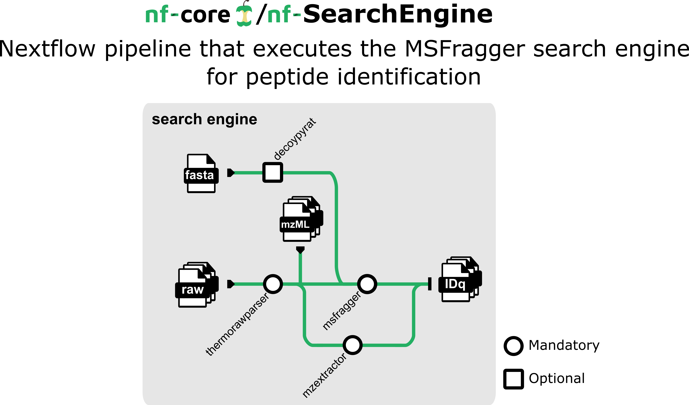

# nf-SearchEngine

nf-SearchEngine is a [Nextflow](https://www.nextflow.io/) pipeline that execute the MSFragger search engine for the peptide identification.



nf-SearchEngine was developed by the Cardiovascular Proteomics Lab/Proteomic Unit at The National Centre for Cardiovascular Research (CNIC, https://www.cnic.es).

This application is licensed under a Creative Commons Attribution-NoDerivatives 4.0 International (CC BY-ND 4.0) License. For further details, read the https://creativecommons.org/licenses/by-nd/4.0/.

# Installation

## Prerequisites
Before you begin, ensure you have met the following requirements:

- You have Linux operating system on your machine. If you have Windows operating system, read the section [Install WSL on Windows](docs/WSL.md)

## Install Singularity

For more information, read the [How to install Singularity](docs/SingularityCE.md) section.

## Download Singularity images

You need to download the Singularity image for the pipeline, ensuring version compatibility with the Nextflow pipeline. See the above *versions* section:
```
cd backends
singularity pull --arch amd64 library://proteomicscnic/next-launcher/search_engine:0.1.0
```

## Install Nextflow

For more information, read the [How to install Nextflow](docs/Nextflow.md) section.

## Install Git

To update the package list, use the following command:
```
sudo apt-get update
```

We now install git with the following command:
```
apt-get install -y git git-lfs
```

# Download the pipeline with the latest release

You can clone the latest release directly using git with the following command:
```
export VERSION=0.1.0 && \
  git clone https://github.com/CNIC-Proteomics/nf-SearchEngine.git --branch ${VERSION} --recursive
```
With the *--recursive* parameter, the submodules repositories are cloned as well.

The list of releases is located on the [releases page](https://github.com/CNIC-Proteomics/nf-SearchEngine/releases).


# Usage

## Execute the pipeline using Raws as input


1. Download test files
```
cd tests && \
wget https://zenodo.org/records/12750690/files/test_Raws_1.zip?download=1 -O test_Raws_1.zip && \
unzip test_Raws_1.zip -d test_Raws_1
```

2. Execute the pipeline:
```
nextflow \
    -log "/tmp/nextflow/log/nf-SearchEngine.log" \
    run main.nf   \
        -profile singularity \
        --raw_files "tests/test_Raws_1/raw_files/*" \
        --database "tests/test_Raws_1/database.fasta" \
        --add_decoys true \
        --decoy_prefix "DECOY_"\
        --msf_params_file "tests/test_Raws_1/msf_params_file.params" \
        --reporter_ion_isotopic "tests/test_Raws_1/reporter_ion_isotopic.tsv" \
        --outdir  "tests/test_Raws_1" \
        -resume
```

<!-- 
```
nextflow \
    -log "/tmp/nextflow/log/nf-search-engine.log" \
    run main.nf   \
        -profile singularity \
        --raw_files "/mnt/tierra/U_Proteomica/UNIDAD/Softwares/jmrodriguezc/nf-SearchEngine/tests/test1/inputs/raw_files/*" \
        --database "/mnt/tierra/U_Proteomica/UNIDAD/Softwares/jmrodriguezc/nf-SearchEngine/tests/test1/inputs/database.fasta" \
        --add_decoys true \
        --decoy_prefix "DECOY_" \
        --msf_params_file "/mnt/tierra/U_Proteomica/UNIDAD/Softwares/jmrodriguezc/nf-SearchEngine/tests/test1/inputs/msf_params_file.params" \
        --reporter_ion_isotopic "/mnt/tierra/U_Proteomica/UNIDAD/Softwares/jmrodriguezc/nf-SearchEngine/tests/test1/inputs/reporter_ion_isotopic.tsv" \
        --outdir  "/mnt/tierra/U_Proteomica/UNIDAD/Softwares/jmrodriguezc/nf-SearchEngine/tests/test1" \
        -resume
```
 -->


# Image Version history

| Version | Description                  | Singularity image                                                                            			| Code                                                                     | Version |
|---------|------------------------------|----------------------------------------------------------------------------------------------------|--------------------------------------------------------------------------|---------|
| 0.1.1   | Update MSFragger version     |                                                                                              			|                                                                          |         |
|         |                              | [search_engine:0.1.1](https://cloud.sylabs.io/library/proteomicscnic/next-launcher/search_engine)	|                                                                          |         |
|         |                              |                                                                                              			| [MSFragger](https://msfragger.nesvilab.org)                              | 4.1     |
|         |                              |                                                                                              			| [ThermoRawFileParser](https://github.com/compomics/ThermoRawFileParser)  | 1.4.2   |
|         |                              |                                                                                              			| [DecoyPYrat](https://www.sanger.ac.uk/tool/decoypyrat/)							 		 | 2.13    |
|         |                              |                                                                                              			| [MZ_extractor](https://github.com/CNIC-Proteomics/mz_extractor)			 		 | 1.0	   |

