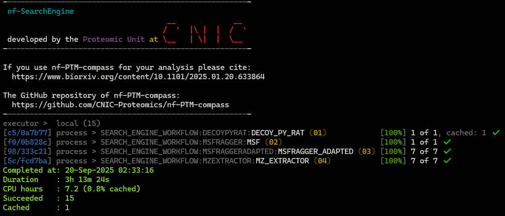

# nf-SearchEngine

nf-SearchEngine is a [Nextflow](https://www.nextflow.io/) pipeline that execute the MSFragger search engine for the peptide identification.


nf-SearchEngine was developed by the Cardiovascular Proteomics Lab/Proteomic Unit at The National Centre for Cardiovascular Research (CNIC, https://www.cnic.es).

This application is licensed under a Creative Commons Attribution-NoDerivatives 4.0 International (CC BY-ND 4.0) License. For further details, read the https://creativecommons.org/licenses/by-nd/4.0/.


# Installation

## Prerequisites

Before you begin, ensure you have met the following requirements:

- A **Linux operating system** is needed on your machine.

## Linux operating system on Windows

If you are using a Windows operating system, refer to the section [Install WSL on Windows](docs/WSL.md) to set up a Linux operating system on your Windows machine.

## Install Singularity

For more information, read the [How to install Singularity](docs/SingularityCE.md) section.

## Install Nextflow

For more information, read the [How to install Nextflow](docs/Nextflow.md) section.

## Install Git

For more information, read the [How to install Git](docs/Git.md) section.


# Download the pipeline with the latest release

Export an environment variable to define the version:
```
export PIPELINE_VERSION=1.7
```
Note: The list of releases is located on the [releases page](https://github.com/CNIC-Proteomics/nf-SearchEngine/releases).

You can clone the latest release directly using git with the following command:
```
git clone https://github.com/CNIC-Proteomics/nf-SearchEngine.git --branch ${PIPELINE_VERSION} --recursive
```
With the *--recursive* parameter, the submodules repositories are cloned as well.


# Download Singularity images

Export an environment variable to define the version of singularity image:
```
export IMAGE_VERSION=1.7
```
Note: The list of releases is located on the [singularity repository page](https://cloud.sylabs.io/library/proteomicscnic/next-launcher/search_engine).

Navigate to the backends folder:
```
cd nf-SearchEngine/backends
```

You need to download the Singularity image for the pipeline, ensuring version compatibility with the Nextflow pipeline. See the above *versions* section:
```
singularity pull --arch amd64 library://proteomicscnic/next-launcher/search_engine:${IMAGE_VERSION}
```

You might see warning messages like the following. You can discard or ignore them:

    WARNING: failed to get key material: 404 Not Found: entity not found
    WARNING: integrity: signature object 5 not valid: openpgp: signature made by unknown entity
    WARNING: Skipping container verification

Create a symbolic link
```
ln -s search_engine_${IMAGE_VERSION}.sif search_engine.sif
```


# Usage

## Execute the pipeline with samples

The input files provided are open search results for mouse heteroplasmy (`heart tissue`) at the following URL:

https://zenodo.org/records/17912282/files/heteroplasmic_heart.zip?download=1


1. Download sample files
```
cd samples && \
wget https://zenodo.org/records/17912282/files/heteroplasmic_heart.zip?download=1 -O heteroplasmic_heart.zip && \
unzip heteroplasmic_heart.zip && \
cd ..
```

2. Execute several pipelines:

    2.1. Execute the pipeline:
    + Run MSFragger with the mzML files as input.
    + Generate decoy proteins.
    + Extract quantifications from the mzML files.
    ```
    nextflow \
        -log "/tmp/nextflow/log/nf-searchengine.log" \
        run main.nf   \
            -profile singularity \
            --create_mzml false \
            --add_decoys true \
            --raw_files "samples/heteroplasmic_heart/inputs/mzMLs/*.mzML" \
            --database "samples/heteroplasmic_heart/inputs/database.fasta" \
            --decoy_prefix "DECOY_"\
            --msf_params_file "samples/heteroplasmic_heart/inputs/msf_params_file.params" \
            --reporter_ion_isotopic "samples/heteroplasmic_heart/inputs/reporter_ion_isotopic.tsv" \
            --outdir  "samples/heteroplasmic_heart/results" \
            -resume
    ```

    2.2. Execute the pipeline:
    + Run MSFragger with the mzML files as input.
    + Generate decoy proteins.
    + Extract quantifications from the mzML files.
    + Correct post-translational modifications (PTMs) using the REFMOD module.
    ```
    nextflow \
        -log "/tmp/nextflow/log/nf-searchengine.log" \
        run main.nf   \
            -profile singularity \
            --create_mzml false \
            --add_decoys true \
            --exec_refmod true \
            --raw_files "samples/heteroplasmic_heart/inputs/mzMLs/*.mzML" \
            --database "samples/heteroplasmic_heart/inputs/database.fasta" \
            --decoy_prefix "DECOY_"\
            --msf_params_file "samples/heteroplasmic_heart/inputs/msf_params_file.params" \
            --dm_file "samples/heteroplasmic_heart/inputs/dm_list.tsv" \
            --refmod_params_file "samples/heteroplasmic_heart/inputs/refmod_params_file.ini" \
            --reporter_ion_isotopic "samples/heteroplasmic_heart/inputs/reporter_ion_isotopic.tsv" \
            --outdir  "samples/heteroplasmic_heart/results" \
            -resume
    ```

### Hardware specifications

The computational experiment was performed on a virtualized environment running under *Windows Subsystem for Linux 2 (WSL2)*. The software and hardware configuration were as follows:

* Operating system: Ubuntu 22.04.5 LTS (Jammy Jellyfish), kernel version 6.6.87.2
* Processor: Intel Xeon E5-2670 (Sandy Bridge) with 16 physical cores and 32 threads (Hyper-Threading enabled), base frequency ~2.6 GHz, cache hierarchy: L1 = 1 MB, L2 = 4 MB, L3 = 20 MB
* Memory (RAM): 39 GiB
* Storage: ~2 TiB available capacity

### Execution trace with Time log

The execution trace for the sample dataset was generated using the `nextflow` command above.

The trace log shows the execution of each module along with the corresponding **execution time**.




## Download more samples

+ You can download the input files for this `liver` sample from the study by Bagwan N, Bonzon-Kulichenko E, Calvo E, et al. [1] at the following URL:

https://zenodo.org/records/17912282/files/heteroplasmic_liver.zip?download=1

To execute the pipeline, follow the same steps as in Sample 1.

+ You can download the input files for this `muscle` sample from the study by Bagwan N, Bonzon-Kulichenko E, Calvo E, et al. [1] at the following URL:

https://zenodo.org/records/17912282/files/heteroplasmic_muscle.zip?download=1

To execute the pipeline, follow the same steps as in Sample 1.


## References

[1] Bagwan N, Bonzon-Kulichenko E, Calvo E, et al. Comprehensive Quantification of the Modified Proteome Reveals Oxidative Heart Damage in Mitochondrial Heteroplasmy. Cell Reports. 2018;23(12):3685-3697.e4. https://doi.org/10.1016/j.celrep.2018.05.080

[2] Kong, A., Leprevost, F., Avtonomov, D. et al. MSFragger: ultrafast and comprehensive peptide identification in mass spectrometry–based proteomics. Nat Methods 14, 513–520 (2017). https://doi.org/10.1038/nmeth.4256


# Image Version History

For more information about the program version included within the Singularity version, refer to the [changelog](changelog.md) for the current version.
